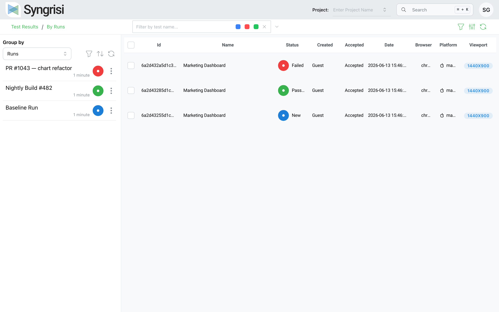
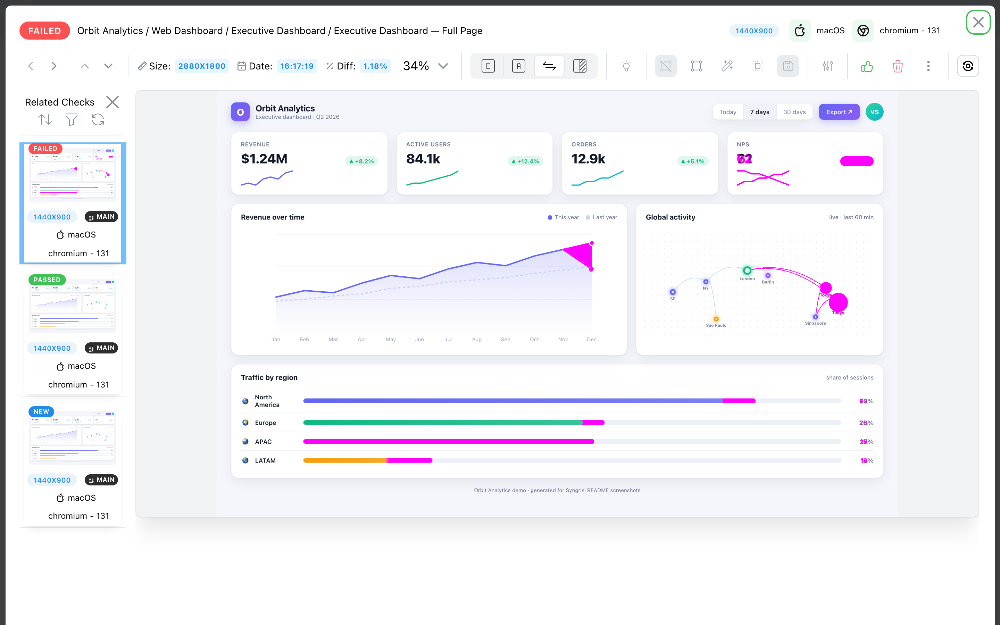
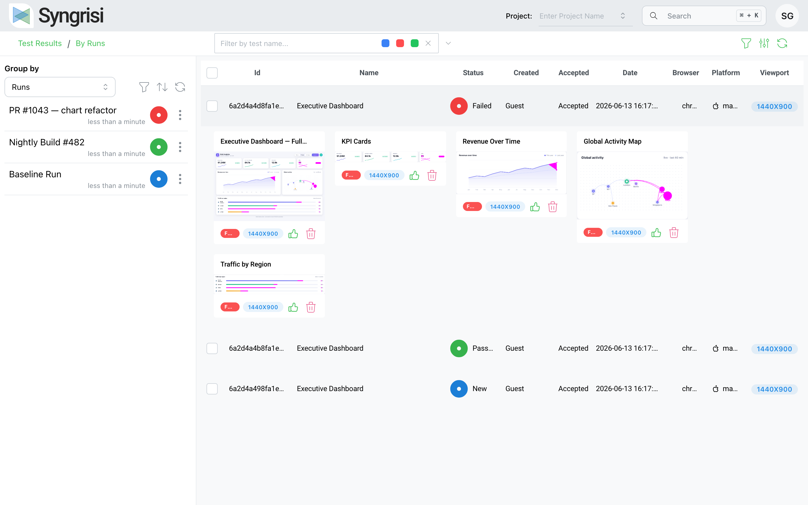

<div align="center">


# Syngrisi

### Open-source Visual Testing Platform — catch visual regressions before your users do.

An **open-source visual regression testing platform** to capture screenshots from your
automated tests, compare them against approved baselines, and review every pixel change
in a fast, self-hosted web UI.

[](https://www.npmjs.com/package/@syngrisi/syngrisi)
[](https://github.com/syngrisi/syngrisi/actions)
[](packages/syngrisi/LICENSE.md)
[](https://nodejs.org)
[](#contributing)
[](https://github.com/syngrisi/syngrisi/stargazers)

</div>

---

## 🎬 Demo

https://user-images.githubusercontent.com/23633060/225095007-39ee0a29-61c1-4f46-99ab-1af67052accb.mp4

<div align="center">
  
</div>

## Why Syngrisi?

Visual bugs — a broken layout, a clipped chart, a shifted button — slip straight through
unit tests and code review. Dedicated visual testing clouds catch them, but they are
expensive, send your screenshots to someone else's servers, and lock you in.

**Syngrisi gives you the same workflow, open-source and self-hosted:**

- 🆓 **Free & MIT-licensed** — no per-screenshot pricing, no seat limits.
- 🔒 **Your data stays yours** — runs entirely on your own infrastructure.
- 🔌 **Drop-in SDKs** for Playwright, WebdriverIO and Cucumber, plus a REST API.
- 🐳 **Up in one command** with Docker.

## ✨ Features

- 🖼️ **Pixel-perfect comparison** — powered by a Resemble.js-based engine with `nothing` / `antialiasing` / `colors` match modes.
- 🎯 **Tolerance threshold** — let checks pass within a configurable mismatch budget (per-baseline or per-check).
- 🙈 **Ignore regions & vertical-shift handling** — mask dynamic areas and absorb scroll offsets.
- 🌐 **Cross-browser, OS & viewport** — capture and group results by browser, platform, viewport and git branch.
- ✅ **Review workflow** — accept/reject baselines, mark checks as bugs, batch-accept, and share single checks via link.
- 🧭 **Powerful filtering & grouping** — group by run, suite, browser, platform or status; build nested `AND`/`OR` filters.
- 🤖 **Root Cause Analysis** _(beta)_ — captures a DOM snapshot alongside each screenshot to help explain **why** a check changed.
- 🔐 **Auth, roles & SSO** — username/password, API keys, plus OAuth2 / SAML 2.0 single sign-on and an admin panel.
- 🧩 **Plugin system & rich configuration** — extend behaviour and tune everything through environment variables.
- 🐳 **Self-hosted & Docker-ready** — Express + MongoDB backend, React + Mantine UI.

## 📸 Screenshots

<table>
  <tr>
    <td width="50%"><br/><sub><b>Diff viewer</b> — baseline vs. actual with highlighted changes.</sub></td>
    <td width="50%"><br/><sub><b>Root Cause Analysis</b> — the DOM-level changes behind a diff, ranked by severity.</sub></td>
  </tr>
  <tr>
    <td width="50%"><br/><sub><b>Clear diffs</b> — exactly what changed, down to a single chart bar.</sub></td>
    <td width="50%"><br/><sub><b>Per-test checks</b> — every visual check at a glance.</sub></td>
  </tr>
</table>

## 🚀 Quick Start

### Scaffold a new project (recommended)

```bash
npm init sy@latest
```

The interactive CLI sets up a ready-to-run project with Syngrisi and your chosen test
framework. Prefer a template? Start from the
[Playwright](https://github.com/syngrisi/syngrisi-playwright-boilerplate) or
[Cucumber](https://github.com/syngrisi/syngrisi-cucumber-boilerplate) boilerplate
([▶ open in Gitpod](https://gitpod.io/#https://github.com/syngrisi/syngrisi-cucumber-boilerplate)).

### Run the server with Docker

```bash
mkdir my-syngrisi && cd my-syngrisi
curl -LO https://raw.githubusercontent.com/syngrisi/syngrisi/main/packages/syngrisi/syngrisi-app.dockerfile
curl -LO https://raw.githubusercontent.com/syngrisi/syngrisi/main/packages/syngrisi/docker-compose.yml
docker compose up
```

Then open **http://localhost:3000**. See the
[main app README](packages/syngrisi/README.md) for native (non-Docker) setup.

## 🧪 Use it in your tests

**Playwright** (via [`@syngrisi/playwright-sdk`](packages/playwright-sdk/README.md)):

```ts
import { test } from '@playwright/test';
import { PlaywrightDriver } from '@syngrisi/playwright-sdk';

test('homepage looks right', async ({ page }) => {
  const driver = new PlaywrightDriver({
    page,
    url: 'http://localhost:3000/',
    apiKey: process.env.SYNGRISI_API_KEY,
  });

  await driver.startTestSession({ params: { app: 'My App', test: 'Homepage', branch: 'main' } });
  await page.goto('https://example.com');
  await driver.check({ checkName: 'Homepage', imageBuffer: await page.screenshot() });
  await driver.stopTestSession();
});
```

Also available: [`@syngrisi/wdio-sdk`](packages/wdio-sdk/README.md) for WebdriverIO,
[`wdio-syngrisi-cucumber-service`](packages/wdio-syngrisi-cucumber-service/README.md) for
Cucumber, and the framework-agnostic
[`@syngrisi/core-api`](packages/core-api/README.md) REST client.

## ⚖️ How it compares

| | **Syngrisi** | Applitools | Percy | Chromatic |
|---|:---:|:---:|:---:|:---:|
| Open source (MIT) | ✅ | ❌ | ❌ | ❌ |
| Self-hosted / data ownership | ✅ | Enterprise only | ❌ (cloud) | ❌ (cloud) |
| Free to run | ✅ | ❌ | Limited tier | Limited tier |
| Pixel comparison & diffs | ✅ | ✅ | ✅ | ✅ |
| Playwright & WebdriverIO SDKs | ✅ | ✅ | ✅ | Partial |
| Root Cause Analysis | ✅ _(beta)_ | ✅ _(AI)_ | — | — |
| Managed cloud & scaling | self-managed | ✅ | ✅ | ✅ |

Syngrisi trades a managed cloud and a large hosted feature set for being **free,
open-source and fully under your control**. If you want to own your visual testing
stack, it's built for you.

## 📦 Monorepo

```
packages/
├── syngrisi/                              # Main application (Express + React)
├── core-api/                              # Framework-agnostic REST client
├── playwright-sdk/                        # Playwright SDK
├── wdio-sdk/                              # WebdriverIO SDK
├── wdio-syngrisi-cucumber-service/        # WebdriverIO + Cucumber service
├── wdio-cucumber-viewport-logger-service/ # In-viewport step logger
├── node-resemble.js/                      # Image comparison library
└── create-sy/                             # `npm init sy` project scaffolder
```

- **Just running tests?** Install the SDK for your framework (`@syngrisi/playwright-sdk` or `@syngrisi/wdio-sdk`).
- **Hosting the server?** Use the `@syngrisi/syngrisi` app (Docker or native).
- **Starting from scratch?** Run `npm init sy@latest`.

## 📚 Documentation

- 📖 [Main App Guide](packages/syngrisi/README.md)
- 🤖 [AI Features](packages/syngrisi/docs/AI_FEATURES.md) · [Root Cause Analysis](packages/syngrisi/docs/RCA.md)
- 🧩 [Plugins](packages/syngrisi/docs/PLUGINS.md)
- ⚙️ [Environment Variables](packages/syngrisi/docs/environment_variables.md)
- 🛠️ [Development Guide](packages/syngrisi/docs/DEVELOPMENT.md) · [Release Cycle](docs-src/RELEASE_CYCLE.md)
- 🔗 API reference: Swagger UI at `/swagger/` on a running instance.

<details>
<summary><b>Local development</b></summary>

**Requirements:** Node.js ≥ 22.19, Yarn ≥ 1.22 (npm is blocked in this repo), MongoDB 8.0+.

```bash
yarn install:all   # install server + UI dependencies
yarn build         # build all packages
yarn start         # start the main application
yarn test          # run the E2E suite (from packages/syngrisi)
```

See the [Development Guide](packages/syngrisi/docs/DEVELOPMENT.md) for the full workflow.

</details>

## 🤝 Contributing

Contributions are welcome! Please open an issue to discuss substantial changes first.
See [`AGENTS.md`](AGENTS.md) and the [Release Cycle](docs-src/RELEASE_CYCLE.md) for repo
conventions, then send a PR.

## License

[MIT](packages/syngrisi/LICENSE.md) © Syngrisi contributors
