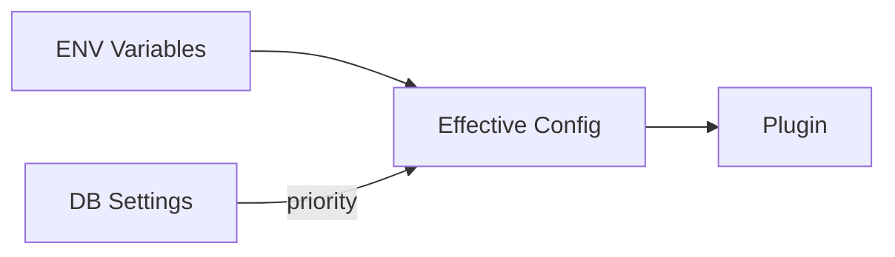
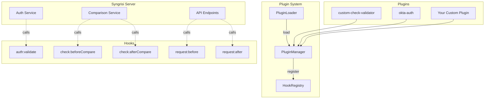
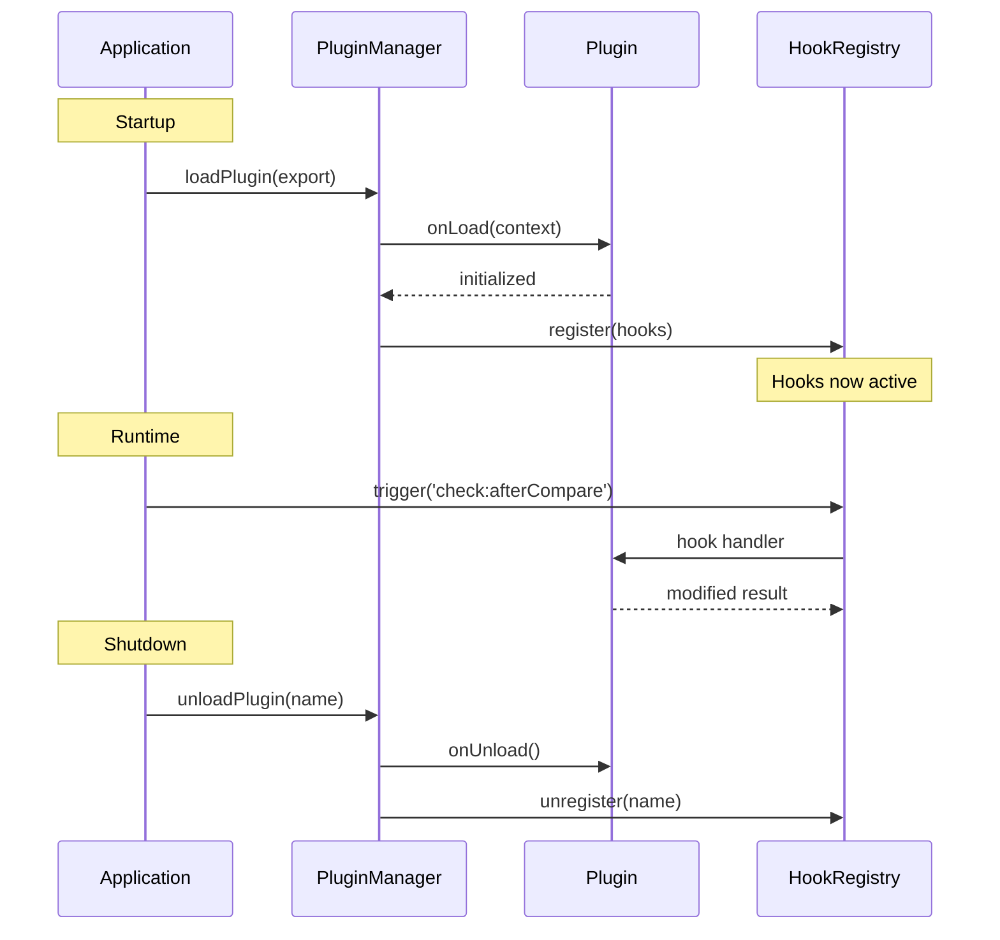
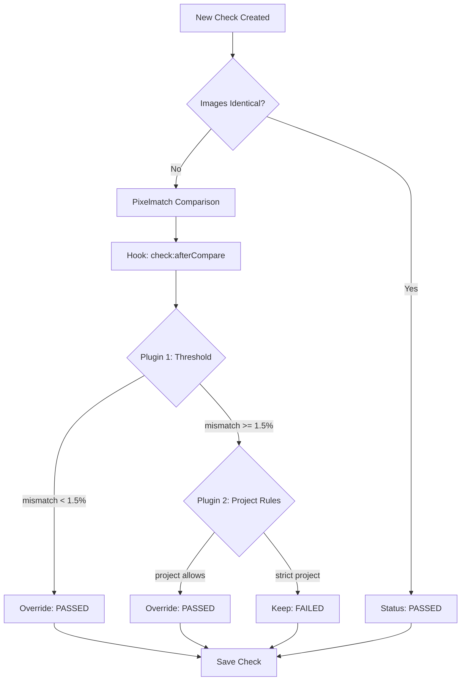

# Syngrisi Plugin System

Расширяемая архитектура плагинов для кастомизации workflow визуальной регрессии.

---

## Зачем нужны плагины?

Система плагинов решает следующие задачи:

| Задача                  | Описание                                     | Пример                                           |
| ----------------------- | -------------------------------------------- | ------------------------------------------------ |
| **Кастомная валидация** | Изменение логики pass/fail для чеков         | Пропускать mismatch < 1% как passed              |
| **Пороговые значения**  | Автоматическое игнорирование мелких различий | Anti-aliasing артефакты, субпиксельный рендеринг |
| **Интеграция auth**     | Добавление корпоративных провайдеров         | Okta, Azure AD, SAML                             |
| **Кастомные правила**   | Специфичная логика для разных типов проверок | Разные пороги для мобильных/desktop              |
| **Аудит и мониторинг**  | Перехват и логирование запросов              | Метрики, отправка в Datadog                      |

---

## Структура директорий

```
packages/syngrisi/
├── src/server/plugins/
│   ├── core/                       # Ядро системы плагинов
│   │   ├── PluginManager.ts        # Управление жизненным циклом
│   │   ├── PluginLoader.ts         # Загрузка плагинов
│   │   ├── HookRegistry.ts         # Реестр хуков
│   │   └── index.ts
│   │
│   ├── sdk/                        # SDK для разработки плагинов
│   │   ├── types.ts                # TypeScript типы
│   │   ├── context.ts              # Контекст плагина
│   │   └── index.ts
│   │
│   └── builtin/                    # Встроенные плагины
│       ├── custom-check-validator/ # Валидация с порогом
│       │   └── plugin.ts
│       └── okta-auth/              # Okta OAuth
│           └── plugin.ts
│
├── plugins/                        # 📁 Директория для КАСТОМНЫХ плагинов
│   ├── my-threshold-plugin/
│   │   └── index.ts
│   └── slack-notifier/
│       └── index.ts
```

---

## Как включить плагины

### 1. Встроенные плагины

Для загрузки плагинов необходимо перечислить их в переменной `SYNGRISI_PLUGINS_ENABLED`.

```bash
# Список активных плагинов (через запятую)
SYNGRISI_PLUGINS_ENABLED=custom-check-validator,jwt-auth
```

Дополнительно можно управлять состоянием через специфичные переменные (если плагин уже в списке):

```bash
# Включить встроенный плагин валидации
SYNGRISI_PLUGIN_CHECK_VALIDATOR_ENABLED=true
SYNGRISI_PLUGIN_CHECK_VALIDATOR_MISMATCH_THRESHOLD=1.5

# Включить Okta auth
SYNGRISI_PLUGIN_OKTA_ENABLED=true
SYNGRISI_PLUGIN_OKTA_ISSUER=https://your-domain.okta.com/oauth2/default
```

### 2. Кастомные плагины

```bash
# Указать директорию с кастомными плагинами
SYNGRISI_PLUGINS_DIR=/path/to/your/plugins
```

Каждый подкаталог в `SYNGRISI_PLUGINS_DIR` должен содержать `index.ts` или `index.js`.

---

## Конфигурация

Система поддерживает два источника конфигурации с приоритетом:

1. **Admin UI (Database)**: Настройки, измененные через UI (`/admin/plugins`), имеют наивысший приоритет.
2. **Environment Variables**: Значения по умолчанию, заданные при старте сервера.



---

## Архитектура



---

## Жизненный цикл плагина



---

## Доступные хуки

| Hook                  | Сигнатура                                                    | Описание                               |
| --------------------- | ------------------------------------------------------------ | -------------------------------------- |
| `auth:validate`       | `(req, res, ctx) => AuthResult \| null`                      | Кастомная аутентификация               |
| `check:beforeCompare` | `(checkCtx, pluginCtx) => CheckCompareContext \| SkipResult` | До сравнения изображений               |
| `check:afterCompare`  | `(checkCtx, result, pluginCtx) => CompareResult`             | После сравнения, можно изменить статус |
| `request:before`      | `(req, res, next, ctx) => void`                              | Express middleware перед обработкой    |
| `request:after`       | `(req, res, data, ctx) => data`                              | Модификация ответа                     |

---

## Практические примеры

### Пример 1: Плагин с порогом mismatch

**Цель:** Чеки с различием менее 1.5% должны проходить автоматически.

```typescript
// plugins/threshold-plugin/index.ts
import { SyngrisiPlugin, CheckCompareContext } from '@syngrisi/plugins/sdk';
import { CompareResult } from '@services/comparison.service';

const THRESHOLD = 1.5; // процент

export default {
    manifest: {
        name: 'my-threshold-plugin',
        version: '1.0.0',
        description: 'Auto-pass checks below threshold',
        priority: 50,
    },

    hooks: {
        'check:afterCompare': async (ctx: CheckCompareContext, result: CompareResult) => {
            // Парсим результат сравнения
            const data = result.result ? JSON.parse(result.result) : {};
            const mismatch = data.rawMisMatchPercentage || 0;

            // Если mismatch ниже порога и статус failed — меняем на passed
            if (result.status === 'failed' && mismatch < THRESHOLD) {
                return {
                    ...result,
                    status: 'passed',
                    failReasons: [],
                    result: JSON.stringify({
                        ...data,
                        autoPassedByPlugin: true,
                        threshold: THRESHOLD,
                    }),
                };
            }

            return result;
        },
    },
} satisfies SyngrisiPlugin;
```

**Использование:**

```bash
SYNGRISI_PLUGINS_DIR=/app/plugins
```

---

### Пример 2: Разные пороги для разных проектов

```typescript
// plugins/project-thresholds/index.ts
const PROJECT_THRESHOLDS: Record<string, number> = {
    'mobile-app': 2.0, // Мобильное приложение — больший порог
    'desktop-web': 0.5, // Desktop — строже
    'legacy-system': 5.0, // Legacy — самый мягкий
};

export default {
    manifest: {
        name: 'project-thresholds',
        version: '1.0.0',
    },

    hooks: {
        'check:afterCompare': async (ctx, result, pluginCtx) => {
            const projectName = ctx.checkParams.app || 'default';
            const threshold = PROJECT_THRESHOLDS[projectName] ?? 0;

            const data = result.result ? JSON.parse(result.result) : {};
            const mismatch = data.rawMisMatchPercentage || 0;

            if (result.status === 'failed' && mismatch < threshold) {
                pluginCtx.logger.info(`Project ${projectName}: mismatch ${mismatch}% < threshold ${threshold}%`);
                return { ...result, status: 'passed', failReasons: [] };
            }

            return result;
        },
    },
};
```

---

### Пример 3: Slack уведомления о failed чеках

```typescript
// plugins/slack-notifier/index.ts
export default {
    manifest: {
        name: 'slack-notifier',
        version: '1.0.0',
    },

    async onLoad(context) {
        this.webhookUrl = context.pluginConfig.webhookUrl;
    },

    hooks: {
        'check:afterCompare': async (ctx, result, pluginCtx) => {
            if (result.status === 'failed') {
                await fetch(this.webhookUrl, {
                    method: 'POST',
                    body: JSON.stringify({
                        text: `❌ Check failed: ${ctx.checkParams.name}`,
                        blocks: [
                            {
                                type: 'section',
                                text: {
                                    type: 'mrkdwn',
                                    text: `*Check:* ${
                                        ctx.checkParams.name
                                    }\n*Status:* Failed\n*Reasons:* ${result.failReasons?.join(', ')}`,
                                },
                            },
                        ],
                    }),
                });
            }
            return result;
        },
    },
};
```

**Конфигурация:**

```bash
SYNGRISI_PLUGIN_SLACK_NOTIFIER_WEBHOOK_URL=https://hooks.slack.com/services/...
```

---

### Пример 4: Игнорирование определенных областей

```typescript
// plugins/ignore-regions/index.ts
export default {
    manifest: {
        name: 'dynamic-ignore-regions',
        version: '1.0.0',
    },

    hooks: {
        'check:beforeCompare': async (ctx, pluginCtx) => {
            // Добавляем ignore region для всех чеков с тегом "header"
            if (ctx.checkParams.name?.includes('header')) {
                ctx.compareOptions = {
                    ...ctx.compareOptions,
                    ignoreRegions: [
                        ...(ctx.compareOptions?.ignoreRegions || []),
                        { x: 0, y: 0, width: 1920, height: 60 }, // Header area
                    ],
                };
            }
            return ctx;
        },
    },
};
```

---

## Flow: Как работает check:afterCompare



---

## Встроенные плагины

### custom-check-validator

Универсальный валидатор с поддержкой:

-   Порогового значения mismatch
-   Кастомных JavaScript скриптов

**Конфигурация:**

```bash
SYNGRISI_PLUGIN_CHECK_VALIDATOR_ENABLED=true
SYNGRISI_PLUGIN_CHECK_VALIDATOR_MISMATCH_THRESHOLD=1.5
SYNGRISI_PLUGIN_CHECK_VALIDATOR_SCRIPT_PATH=/path/to/script.js
```

**Пример скрипта:**

```javascript
// validation-script.js
const mismatch = ctx.resultData.rawMisMatchPercentage;
const checkName = ctx.check.checkParams.name;

// Разные правила для разных типов чеков
if (checkName.includes('flaky')) {
    if (mismatch < 5) {
        return { status: 'passed', message: 'Flaky element tolerance' };
    }
}

if (checkName.includes('animation')) {
    if (mismatch < 10) {
        return { status: 'passed', message: 'Animation tolerance' };
    }
}
```

---

### okta-auth

OAuth2 аутентификация через Okta.

```bash
SYNGRISI_PLUGIN_OKTA_ENABLED=true
SYNGRISI_PLUGIN_OKTA_ISSUER=https://your-domain.okta.com/oauth2/default
SYNGRISI_PLUGIN_OKTA_CLIENT_ID=your-client-id
SYNGRISI_PLUGIN_OKTA_CLIENT_SECRET=your-client-secret
```

---

### jwt-auth

M2M аутентификация через JWT и JWKS валидацию. Поддерживает автоматическое создание сервисных пользователей.

```bash
SYNGRISI_PLUGIN_JWT_AUTH_ENABLED=true
SYNGRISI_PLUGIN_JWT_AUTH_JWKS_URL=https://login.example.com/.well-known/jwks.json
SYNGRISI_PLUGIN_JWT_AUTH_ISSUER=login.example.com
SYNGRISI_PLUGIN_JWT_AUTH_ISSUER_MATCH=strict
SYNGRISI_PLUGIN_JWT_AUTH_AUDIENCE=syngrisi
SYNGRISI_PLUGIN_JWT_AUTH_REQUIRED_SCOPES=syngrisi:api:read,syngrisi:api:write
SYNGRISI_PLUGIN_JWT_AUTH_HEADER_NAME=Authorization
SYNGRISI_PLUGIN_JWT_AUTH_HEADER_PREFIX=Bearer
SYNGRISI_PLUGIN_JWT_AUTH_AUTO_PROVISION=true
SYNGRISI_PLUGIN_JWT_AUTH_SERVICE_USER_ROLE=user
SYNGRISI_PLUGIN_JWT_AUTH_JWKS_CACHE_TTL=3600000
```

---

## Context API

### PluginContext

```typescript
interface PluginContext {
    config: {
        connectionString: string; // MongoDB URI
        defaultImagesPath: string; // Путь к snapshot'ам
    };

    logger: {
        info(msg: string, opts?: object): void;
        warn(msg: string, opts?: object): void;
        error(msg: string, opts?: object): void;
        debug(msg: string, opts?: object): void;
    };

    models: {
        User: typeof User;
        Check: typeof Check;
        Baseline: typeof Baseline;
    };

    pluginConfig: Record<string, unknown>; // Effective config (merged DB + ENV)
}
```

### CheckCompareContext

```typescript
interface CheckCompareContext {
    expectedSnapshot: SnapshotDocument; // Baseline snapshot
    actualSnapshot: SnapshotDocument; // Current check snapshot
    checkParams: {
        name: string;
        app: string;
        branch: string;
        viewport: string;
        browserName: string;
        os: string;
        // ...
    };
    baseline?: BaselineDocument;
    compareOptions?: {
        ignoreRegions?: Array<{ x; y; width; height }>;
        matchType?: 'strict' | 'relaxed';
    };
}
```

---

## Приоритеты выполнения

Плагины выполняются в порядке **возрастания приоритета** (меньший номер = выше приоритет).

| Диапазон | Назначение                | Примеры                       |
| -------- | ------------------------- | ----------------------------- |
| 1-9      | Критические auth плагины  | `jwt-auth` (priority: 10)     |
| 10-49    | Системные плагины         | Специальные auth & security   |
| 50-99    | Встроенные плагины        | `custom-check-validator`      |
| 100      | По умолчанию              | Пользовательские без priority |
| 101+     | Низкоприоритетные плагины | Логирование, уведомления      |

> [!TIP]
> Плагины с **меньшим** priority выполняются **раньше**. Используйте низкий приоритет (1-10) для плагинов, которые должны обрабатывать данные первыми, например auth-плагины.

### Встроенные приоритеты

| Плагин                   | Priority | Обоснование                                               |
| ------------------------ | -------- | --------------------------------------------------------- |
| `jwt-auth`               | 10       | Auth плагин должен выполняться до стандартной auth логики |
| `custom-check-validator` | 50       | Стандартный приоритет для обработки после сравнения       |

> [!NOTE]
> При добавлении своего auth-плагина используйте priority < 10 если он должен выполняться раньше `jwt-auth`, или priority 10-20 если после.

---

## Отладка

```bash
# Включить debug логи плагинов
SYNGRISI_LOG_LEVEL=debug

# Проверить загруженные плагины через API
curl http://localhost:3000/v1/app/info | jq '.plugins'

# Пример ответа
{
  "plugins": [
    { "name": "custom-check-validator", "version": "1.0.0", "loaded": true },
    { "name": "my-threshold-plugin", "version": "1.0.0", "loaded": true }
  ]
}
```

---

## Частые вопросы

### Как передать конфигурацию в кастомный плагин?

Используйте env переменные с префиксом `SYNGRISI_PLUGIN_<PLUGIN_NAME>_`:

```bash
SYNGRISI_PLUGIN_MY_THRESHOLD_PLUGIN_THRESHOLD=2.5
SYNGRISI_PLUGIN_MY_THRESHOLD_PLUGIN_STRICT_MODE=true
```

В плагине:

```typescript
async onLoad(context) {
    const threshold = context.pluginConfig.threshold as number;
    const strictMode = context.pluginConfig.strictMode === 'true';
}
```

### Можно ли отключить плагин временно?

Да, установите `SYNGRISI_PLUGIN_<NAME>_ENABLED=false`.

### Как плагины взаимодействуют между собой?

Плагины выполняются последовательно по приоритету. Результат одного плагина передается следующему. Это позволяет строить цепочки обработки.
