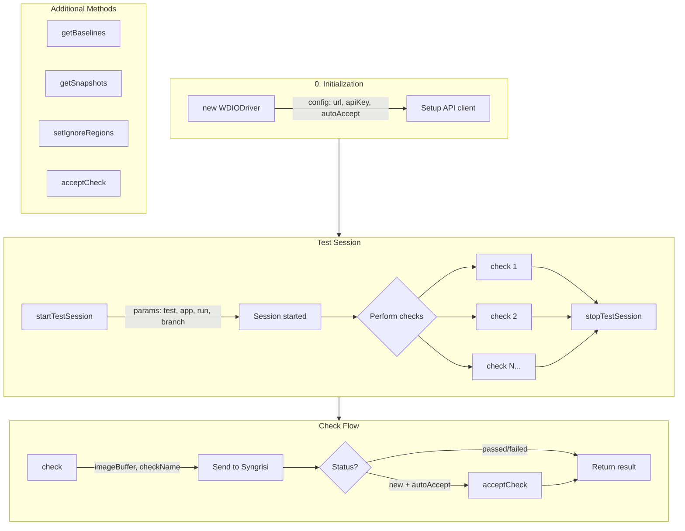

# Syngrisi WebdriverIO SDK

The Syngrisi SDK for WebdriverIO, `@syngrisi/wdio-sdk` provides a simple and powerful way to integrate visual regression
testing into your WebdriverIO tests. By using this SDK, you can send snapshots from your browser tests to the Syngrisi
server for comparison against baseline images, and easily manage visual testing sessions.

## Features

- Start and stop test sessions seamlessly within your test flows.
- Perform visual checks with automatic baseline comparison.
- Fetch baseline and snapshot data programmatically.
- Easily extendable to fit any WebdriverIO-based testing framework.

## Installation

To install the Syngrisi WebdriverIO SDK, run:

```bash
npm install @syngrisi/wdio-sdk
```

## Base Workflow Overview

There are 3 basic steps for each test:



## Usage

The following is a standard workflow to use the SDK in your tests:

### 1. Initialize the Driver

Before starting your test session, initialize the driver with the necessary configuration.

```js
const { WDIODriver } = require('@syngrisi/wdio-sdk');

const config = {
    url: 'your-syngrisi-url',
    apiKey: 'your-api-key',
    autoAccept: false // Optional: auto-accept new baselines (default: false)
};

const driver = new WDIODriver(config);
```

### 2. Start a Test Session

Start a test session with the desired parameters.

```js
const sessionParams = {
    os: 'Windows',
    viewport: '1920x1080',
    browserName: 'chrome',
    browserVersion: '89.0',
    test: 'Homepage Test',
    app: 'Your App',
    run: 'Run 1',
    branch: 'main',
    runident: 'unique-run-identifier',
    suite: 'My Test Suite',
    tags: ['tag1', 'tag2']
};

await driver.startTestSession({ params: sessionParams });
```

### 3. Perform a visual Check

Perform a visual check by providing the check name, image buffer, and any additional parameters.

```js
// Full page screenshot
const fullPageScreenshot = await browser.saveScreenshot('./screenshot.png');
await driver.check({
    checkName: 'Full Page',
    imageBuffer: fullPageScreenshot,
    params: {
        viewport: '1200x800',
        browserName: 'chrome',
        os: 'Windows',
        app: 'MyProject',
        branch: 'develop'
    }
});

// Element screenshot with per-check autoAccept
const headerScreenshot = await $('#header').saveScreenshot();
await driver.check({
    checkName: 'Header',
    imageBuffer: headerScreenshot,
    params: {
        autoAccept: true // Auto-accept this specific check if new
    }
});
```

### Auto-Accept Mode

When `autoAccept` is enabled, new checks (with no existing baseline) are automatically accepted as the new baseline. This is useful for:
- Initial test runs when establishing baselines
- CI/CD pipelines where human review isn't needed for new checks
- Development workflows where baselines change frequently

You can enable auto-accept at two levels:

1. **Driver level** (applies to all checks):
```js
const driver = new WDIODriver({
    url: 'your-syngrisi-url',
    apiKey: 'your-api-key',
    autoAccept: true
});
```

2. **Check level** (overrides driver setting for specific check):
```js
await driver.check({
    checkName: 'Header',
    imageBuffer: screenshot,
    params: {
        autoAccept: true // or false to disable for this check
    }
});
```

### 4. Stop the Test Session

Once all checks are completed, stop the test session.

```js
await driver.stopTestSession();
```

## Additional Methods

### Accept a Check

Programmatically accept a check by setting a new baseline:

```js
const result = await driver.acceptCheck({
    checkId: 'check-id-123',
    baselineId: 'baseline-id-456'
});
```

### Get Baselines

Fetch existing baselines matching criteria:

```js
const baselines = await driver.getBaselines({
    params: {
        name: 'Header',
        app: 'MyProject',
        branch: 'main'
    }
});
```

### Get Snapshots

Retrieve snapshots based on search criteria:

```js
const snapshots = await driver.getSnapshots({
    params: {
        name: 'Header',
        app: 'MyProject',
        branch: 'main'
    }
});
```

### Set Ignore Regions

Set regions to exclude from visual comparison on a baseline:

```js
// First, get the baseline
const baselines = await driver.getBaselines({
    params: {
        name: 'Header',
        app: 'MyProject',
        branch: 'main'
    }
});

// Set ignore regions (coordinates in pixels)
await driver.setIgnoreRegions({
    baselineId: baselines.results[0]._id,
    regions: [
        { left: 0, top: 0, right: 100, bottom: 50 },     // Top banner area
        { left: 200, top: 300, right: 400, bottom: 350 } // Dynamic content
    ]
});

// Or use the Region helper class
await driver.setIgnoreRegions({
    baselineId: 'baseline-id-123',
    regions: [
        new WDIODriver.Region(0, 0, 100, 50)
    ]
});
```

Region coordinates:
- `left`: X coordinate of the left edge
- `top`: Y coordinate of the top edge
- `right`: X coordinate of the right edge
- `bottom`: Y coordinate of the bottom edge

## Environment variables
Environment variables are used to modify the behavior of the Syngrisi WebdriverIO SDK without code changes.

Example: To set the log level to debug, use the following command:

Windows: `set SYNGRISI_LOG_LEVEL=debug`
macOS/Linux: `export SYNGRISI_LOG_LEVEL=debug`

`ENV_POSTFIX` - will add to platform property, you can use this to set some unique platform name for particular
environment
`SYNGRISI_LOG_LEVEL` - logging level (`"trace" | "debug" | "info" | "warn" | "error"`)

## Documentation

For detailed information about all available methods, parameters, and configurations, please refer to
the [Syngrisi GitHub repository](https://github.com/syngrisi/syngrisi).

## License

This project is licensed under the ISC License.

